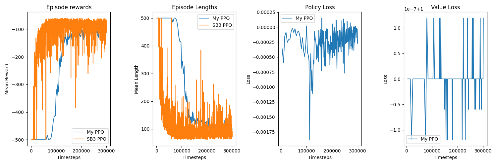

**My implementation of Proximal Policy Optimization (PPO) Reinforcement Learning algorithm from scratch, following the algorithm in the original OpenAI paper.**

To evaluate the performance of my custom PPO I benchmarked it with the stable baseline PPO. The results (on example of Acrobot-v1 environment
after 300000 of total training timesteps):

**Performance**

Both agents learned to solve the game:

Stable baseline PPO:

   <video src="/training_runs/20250517_042955/videos/sb3_ppo/rl-video-episode-0.mp4" width="320" height="240" controls>
   </video>

My PPO:

   <video src="/training_runs/20250517_042955/videos/custom_ppo/rl-video-episode-0.mp4" width="320" height="240" controls>
   </video>

Also there are very unfinished notes on RL (I will add new material I learned recently soon)

To be added soon (polishing the last details): 

- new topics to the notes
- plots and videos for comparison of my implementation of ppo and stable baseline ppo
- parallelized version of ppo

**Related project:** 

gym style snake game: I created the customized env that is fully compatible with RL libraries and can be used interchangible with OpenAI's gym env

Available at https://github.com/TatianaUshakova/Gym_Style_Snake

to be added there
 - experiments with custom design of reward funcitions, structure of learning and partial information availability to identify ways of more efficient learning + notes-reflection about that
